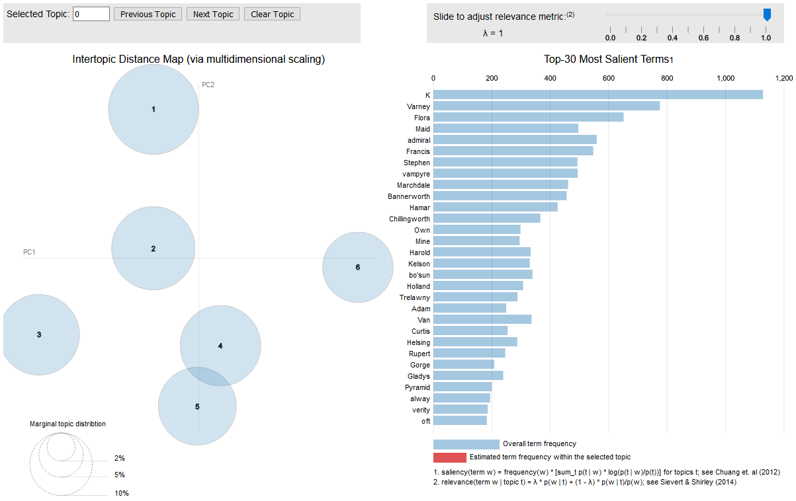
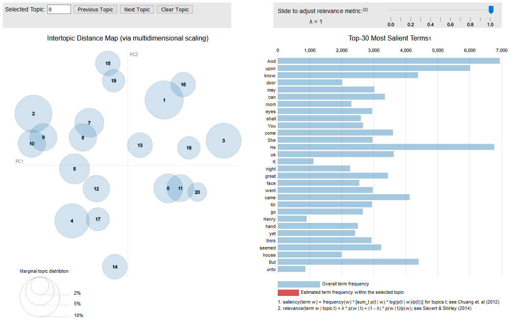
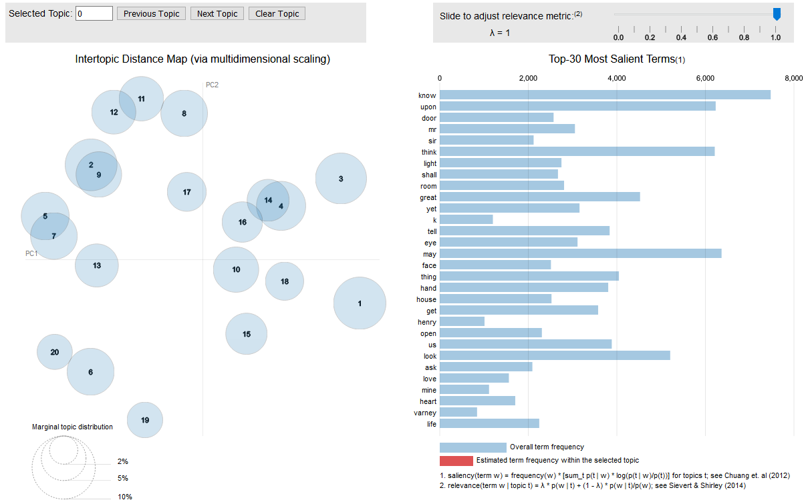
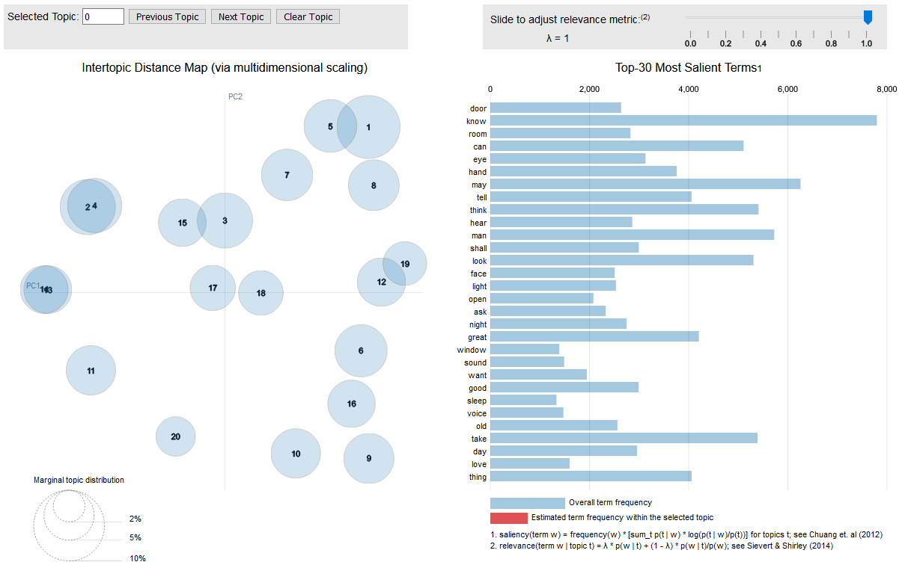
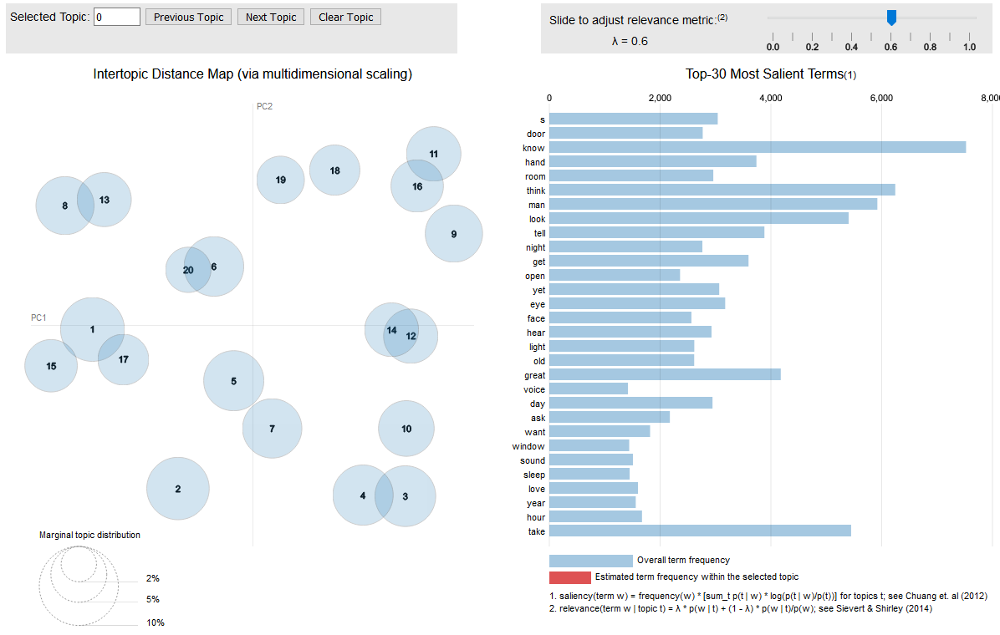

## Abstract

Advanced text preprocessing tasks such lemmatization, part-of-speech tagging, and named-entity recognition can greatly improve natural language processing and text mining results, R programming language seems to lack a beginner-friendly fully-featured framework, that contains implementations for all such task. In this project, attempt to perform advanced text preprocessing using the ported R versions of the natural language processing frameworks *openNLP* and *SpaCy* and demonstrate the result with topic modeling. I conclude that SpaCy is very easy to use, but rather difficult to install with R and that openNLP is slower and conceptually more difficult to use, but simpler to install.

## Keywords: 

Text mining; Preprocessing; Named-Entity Recognition; Lemmatization; Part-of-Speech Tagging; Latent Dirichlet Allocation

## 1 Introduction

In this age of information, immense amounts of data are being generated around us. Text is an incredibly valuable data type, but it is tricky to quantitatively with as is. It often needs to be pre-processed to usable for analysis and modeling. This project aims to explore how to perform advanced text pre-processing in the statistical programming language *R* [@r_core_team_r_2017]. Such preprocessing is usually performed with the general programming language *Python*, but many researchers, including myself, are more accustomed to R, as it is easier to use and more specialized for statistics and data analysis. Therefore, this project explores how advanced preprocessing can be performed in R to make fully streamlined projects kept entirely in R. Most researchers are not expert programmers, so accessible programming examples are always welcome when searching for how to perform tasks such as preprocessing, and hopefully, somebody will find this useful when searching for to perform advanced processing in R.

## 2 Problems and Background

For language data such as text and speech, text mining, the process of extracting meaningful information from unstructured text data using natural language processing techniques, is a fairly accessible sub-field of data science, that is applicable in many different fields such as biomedicine, humanities, and business. Text mining can help uncover latent topics, produce word clouds of frequent or important words, and model sentiment among many other things. Inconveniently, the language data has to be heavily preprocessed for most tasks. The very simple framework *Tidytext* and its accompanying book *Tidy Text Mining with R: A tidy approach* [@queiroz_tidytext_2020; @silge_text_2017] is most novices’ first introduction to Text Mining because of its use of Tidy Data principles [@wickham_tidy_2014-1] and its accessibility. For preprocessing, it only features rudimentary pre-processing functions *tokenization* (dividing text into individual tokens such as words) and *TF-IDF-weighting* (a method for weighting tokens by their importance in a document compared to other documents). A sufficiently featured preprocessing pipeline usually features tokenization, *part-of-speech-tagging* (tagging words by their word-class such as noun or verb), *lemmatization* (transforming words to their dictionary form), *named-entity recognition* (e.g., tagging names and locations), removal of unnecessary words and commonly a type of vectorization or embedding (attempting to compress the meanings of words into vectors based on the contexts they appear in). I have not yet found a fully-featured software framework in R of text preprocessing [@wild_cran_2020]. *SpaCyR* [@benoit_spacyr_2020] is an R wrapper for the fully-featured and fairly fast Python framework SpaCy [@honnibal_spacy_2020]. In Python, SpaCy is great because of its speed, ease of use, and compatibility with many languages. In R, while fast, it is not as beginner-friendly. It is difficult to install because of its need for a separate installation. Another option is the R wrapper *openNLP* for Apache openNLP in *Java* [@openNLP; @hornik_opennlp_2019]. It has most features including models for named-entity recognition, but it lacks a lemmatizer and it does not have a vectorized processing pipeline. Therefore, one has to loop over each text to perform the preprocessing. This makes the framework slower and less beginner-friendly. Lastly, there is the popular and powerful framework *UDPipe* [@wijffels_udpipe_2020]. Problematically, UDPipe does not named-entity recognition, which in contrast to lemmatization is much more troublesome to add afterward, as it essentially requires you to turn to another framework such as openNLP. To explore these frameworks, this project reports my attempt of performing advanced preprocessing with openNLP and SpaCyR.

## 3 Software Framework

This project was entirely performed on my Lenovo T410-I7 PC with an Intel Core i74600U CPU 2.10GHz 2.69GHz processor and 12GVB RAM which runs Windows 10 Enterprise operating system. The project was run on the desktop version of R (4.0.3)[@r_core_team_r_2017] in *RStudio* (3.167) [@rstudio_team_rstudio_2020]. For this project, the Python installation was installed according to the SpaCyR manual. Java was installed automatically with rJava [@urbanek_rjava_2020] dependency of openNLP in R. This document contains all the R code used for this project in code chunks. The majority of the code is commented out to avoid unnecessarily computing elements that take long to run multiple times. Instead, the saved outputs are merely reloaded and printed. A list of package versions is available in table 1 in the appendix. Below is the installation code for the installations.


```{r setup, message = F}
#remotes::install_github("paleolimbot/rbbt") #package for RMarkdown citations
#install.packages("openNLP") ## properly install package with dependencies

#Loading and installing packages with the pacman package
#If p_load() does not work, you will have to install the package manually
pacman::p_load(
  tidyverse,  #essential package for data wrangling and tidy syntax
  LDAvis,  #package for LDA vizualization
  servr,  #for hosting servers
  NLP,  #used for openNLP pipeline
  gutenbergr,  #used for retrieving texts from Project Gutenberg
  text2vec,  #used for LDA-modeling
  textstem,  #used for lemmatization
  openNLP,  #NLP preprocessing pipeline
  tictoc,  #used for timing
  spacyr,  #NLP preprocessing pipeline
  tokenizers,  #used for chunking
  openNLPmodels.en,  #english language model for openNLP
  rbbt,  #package for citations in RMarkdown,
  sessioninfo,  #For getting packageversions
  flextable  #for making tables
  )
#load("workspace.RData")  #load workspace from ealier...

#install.packages("openNLPmodels.en", dependencies=TRUE, repos = "http://datacube.wu.ac.at/")

#spacy_install() #this installs spacy in Python
```

## 4 Data Acquisition and Processing 

### Retrieving the texts

The preprocessing was performed on horror books in English acquired from the digital archive *Project Gutenberg* using the R library *gutenbergr* [@robinson_gutenbergr_2020]. The text files came in individual lines that I collapsed into full texts and removed all punctuation but commas and punctuation marks. The code chunk below shows this process.


```{r, Getting the horror titles from Gutenberg, message = F}
IDs <-  #making a lists of the horror titles that we are going to use
  gutenberg_metadata %>%
  filter(str_detect(gutenberg_bookshelf, "Horror") == T &
           language == "en") %>% distinct(title, .keep_all = T)

IDs %>% glimpse()
```

```{r, eval = F}

texts <- #Downloading the data
  gutenberg_download(IDs$gutenberg_id, meta_fields = c("title", "author"))

texts <-  #collapsing data into single texts
  texts %>% group_by(title) %>% mutate(text = glue::glue_collapse(text, " ")) %>% unique()

texts$text <-  #removing unnecessary characters and
  texts$text %>% str_replace_all("[^[:alnum:][:space:]'\\.,]", "")

texts %>%  #save data
  write_csv("data/texts.csv")
```

```{r}
texts <- read_csv("data/texts.csv") #read the data again
texts %>% glimpse() ##look at the data

```

### Chunking

The texts were divided into smaller chunks of 100 words to lessen the strain on memory. The R library *tokenizers* was used for chunking [@mullen_fast_2018]. It is a bit difficult to get the right chunk size. For some computations, larger chunks make things run faster, and vice versa. In my case, it generally made things run slower, but it lessened the risk of memory overload. Some chunking is needed to make SpaCy run properly.

```{r, chunking texts}
tic()
chunks <- #chunking data to smaller parts
  chunk_text(
    texts$text,
    chunk_size = 100,
    doc_id = texts$title,
    lowercase = F,
    strip_punct = F
  )
toc()#32.97 sec elapsed

text_tibble <-  #turning list into tibble
  tibble(
    "title" = names(chunks) %>% str_replace_all("-\\d+", ""),
    "titleChunked" = names(chunks),
    "text" = chunks
  )

text_tibble %>% glimpse()  #looking at data

#text_tibble %>% write_rds("data/text_tibble.rds")  #saving the data
```
### Lemmatizing with textstem only
For minimal preprocessing, which can be universal for most simple projects, the chunked texts were lemmatized with the *textstem* library [@rinker_textstem_2018]. The functions of textstem are vectorized and acceptably fast, making it a rather beginner-friendly library, that I will argue that more beginners should know about. Textstem can easily be added to the simple tidytext framework. Below is the code chunk for the lemmatization. The preprocessing with SpaCy and openNLP was performed on the non-lemmatized texts.
```{r, eval = F}
tic() #lemmatizing strings...
lemmatized_tibble <- text_tibble %>% mutate(text = text %>% lemmatize_strings())
toc()#897.18 sec elapsed

lemmatized_tibble$text <- lemmatized_tibble$text %>% tolower() #transforming texts to lowercase

lemmatized_tibble %>% write_csv("data/lemmatized_tibble.csv")

```

```{r, message = F}

lemmatized_tibble <- read_csv("data/lemmatized_tibble.csv")#loading the lemmatized data 

lemmatized_tibble %>% glimpse()


```

### Full preprocessing with SpaCy

The first full preprocessing framework I tried was SpaCy. It was a bit of a hassle to install, and it caused problems after the installation as well. *Reticulate* [@ushey_reticulate_2020], the library for porting Python has some trouble with a module called *rpytools*. For some reason, this problem can be overruled by initializing SpaCy twice. The preprocessing itself is incredibly easy. Because it is fully vectorized, one only has to run the *spacy_parse()* function once to tokenize, lemmatize, part-of-speech-tag, and named-entity-tag the whole data set. Additionally, it only took half an hour to run. Using the *tidyverse* library family [@wickham_welcome_2019], I filtered and collapsed the texts. This took a bit over 10 minutes but using a faster library such as *data.table* [@dowle_datatable_2020] and/over parallelizing the process could probably have shaved some minutes off the run time. The code chunk below shows the SpaCy preprocessing.

```{r Spacy}
#you need to have spacy and spacyr properly installed for this chunk

## I run spacy in a virtual environment
# spacy_initialize(condaenv = "C:/Users/thram_000/anaconda3/envs/spacy_condaenv",save_profile = TRUE)

spacey_test <- #Because of an error with Reticulate, the library used for porting Python, I have to run this command twice to properly start the Python session
      try(
        spacy_parse(#preprocess the two first chunks
        unlist(
          chunks[1:2])))

spacey_test <- #test
      try(
        spacy_parse(
        unlist(
          chunks[1:2])))

try(spacey_test %>%
      glimpse())#this it what it looks like

```

```{r, message = F,  eval = F}
#doing it on all the data. Note how long it takes
tic()
spacy_lemmas <- spacy_parse(unlist(chunks))
toc()#1778.81 sec elapsed
spacy_lemmas %>% write_csv("data/spacy_lemmas.csv")

#loading the lemmas. This file is too big for github
spacy_lemmas <- read_csv("data/spacy_lemmas.csv")

tic()  #filtering the lemmas
spacy_texts <- spacy_lemmas %>%
  filter(pos == "ADJ" |
           pos == "ADV" |
           pos == "NOUN" |
           pos == "VERB") %>%
  mutate(title = doc_id %>%
           str_replace_all("-\\d+", ""),
         titleChunked = doc_id) %>%
  select(c("lemma", "title", "titleChunked")) %>%
  group_by(titleChunked) %>%
  mutate(lemma = glue::glue_collapse(lemma, " ")) %>%  #collapsing the texts
  unique() %>%
  rename(text = lemma)
toc() #775.12 sec elapsed

spacy_texts %>% write_csv("data/spacy_texts.csv")

```

```{r, message= F}

spacy_texts <- read.csv("data/spacy_texts.csv")

spacy_texts %>% glimpse()
```

### Full preprocessing with openNLP

The preprocessing with openNLP was based on an example by L. Jockers & Thalken,(2020). The texts were tokenized into sentences and words, and the words, part-of-speech-tagged, named-entity-tagged, and filtered for appropriate word classes. Because openNLP is not fully vectorized, I had to loop over each chunk to perform the preprocessing pipeline. The preprocessing with openNLP took almost two hours. After that, chunks still had to be lemmatized as well. The code chunk below shows the openNLP preprocessing and the lemmatization with textstem.

```{r, openNLP, eval = F}
#defining pipeline for POS tagging
sent_token_annotator <- Maxent_Sent_Token_Annotator()  #sentence tokenizer
word_token_annotator <- Maxent_Word_Token_Annotator()  #word tokenizer
pos_tag_annotator <- Maxent_POS_Tag_Annotator()  #Part-of-speech-tagger


tic() #preprocessing withopenNLP and textstem. It takes almost 2 hours to run
openNLP_texts <- NULL

for (i in seq_along(text_tibble$titleChunked)) {

  para_text <- text_tibble$text[i] #grapping text

  text_s <- as.String(para_text) # turning into the right string format

  #start annotating string
  annotated_string <- annotate(text_s,
                               list(
                                 sent_token_annotator,
                                 word_token_annotator,
                                 pos_tag_annotator
                               ))

  word_pos <- subset(annotated_string, type == "word") #grapping position of words

  tags_v <- sapply(word_pos$features, `[[`, "POS") #grapping pos tags

  words_v <- text_s[word_pos] #grapping pos tags
  #assembling in dataframe
  word_pos_df <- data.frame(Token = words_v,
                            POS = tags_v,
                            stringsAsFactors = FALSE) 

  filtered_df <-
    filter(word_pos_df,#we are only interested in nouns verbs, and adjectives
           POS == "NN"| POS == "NNS" | str_detect(POS, "VB") | str_detect(POS, "JJ")| str_detect(POS, "RB")) %>%
    select(Token) %>%
    mutate(Token = tolower(Token)) #to lower case

  text_v = paste(filtered_df$Token, collapse = " ")

  df = tibble(title = text_tibble$title[i],
    titleChunked = text_tibble$titleChunked[i],
              text = text_v)
    openNLP_texts <- rbind(openNLP_texts, df) #adding to the dataframe

  cat("chunk", i,"out of",length(text_tibble$titleChunked), "\r")#status text
}
toc()#6815.61 sec elapsed

tic() #lemmatizing with textstem
openNLP_texts$text <- openNLP_texts$text %>% lemmatize_strings()
toc()

openNLP_texts %>%  write_csv("data/openNLP_texts.csv")


```

```{r, message= F}
openNLP_texts <-  read_csv("data/openNLP_texts.csv")

openNLP_texts %>% glimpse()  #this is what it looks like afterwards


```
## 5 Topic Modeling

### Latent Dirichlet Allocation

To demonstrate the effect of the preprocessing, I assembled a generic function to perform topic modeling using the implementation of Latent Dirichlet Allocation in the *text2vec* library [@blei_latent_2003; @selivanov_topic_2018]. Topic modeling is a technique for discovering abstract topics from a collection of documents [@selivanov_topic_2018]. Latent Dirichlet Allocation is a probabilistic algorithm for clustering words in a number of latent topics. It has become the industry standard because of its robustness and speed [@blei_latent_2003; @jelodar_latent_2019; @selivanov_topic_2018]. The technique is very useful to gain insight into the contents of a corpus and for assigning topics to documents when there are too many documents to read. My function was heavily based on the example from the webpage of text2vec [@selivanov_topic_2018]. For the sake of simplicity, I choose to use the same parameter values as the example. The function requires the number of topics to be specified. Because this project was about the preprocessing and not about the models, not much attention was turned to the fit of the models. The models were visualized using the R library *LDAvis* for making interactive topic modeling visualizations [@sievert_ldavis_2015] In this document, I have embedded static screen captures of the output. The *$plot()* method starts a server that hosts an interactive visualization. If you run the code, you can explore the model interactively yourself.

```{r, LDA func}
#defining a generic function for creating and fitting LDA models
custom_LDA_func <- function(df, n) {
  tokens = df$text %>% word_tokenizer()
  
  it = itoken(tokens, ids = df$title, progressbar = T)
  
  v = create_vocabulary(it,
                        stopwords = stopwords::stopwords()) %>% 
    prune_vocabulary(v,
                       term_count_min = 5,
                       doc_proportion_max = 0.2)
  
  vectorizer = vocab_vectorizer(v)
  
  dtm = create_dtm(it, vectorizer, type = "dgTMatrix")
  
  lda_model = LDA$new(
    n_topics = n,
    doc_topic_prior = 0.1,
    topic_word_prior = 0.01
  )
  
  doc_topic_distr =
    lda_model$fit_transform(
      x = dtm,
      n_iter = 1000,
      convergence_tol = 0.001,
      n_check_convergence = 25,
      progressbar = T
    )
  return(lda_model)
}

```
### Modeling on raw texts

On the full raw texts, I was able to fit 6 topics. Because I have not read the texts, the topics were essentially meaningless to me, as they were only clusters of names of characters from books that I have not read. The code chunk below and the accompanying screen capture shows the fitting process.

```{r, OG LDA, eval = F}
raw_LDA <- custom_LDA_func(texts, 6)  #fitting LDA on raw books

# raw_LDA %>% write_rds("data/raw_LDA.rds")  #saving model
# 
# raw_LDA <- read_rds("data/raw_LDA.rds") #loading model

#this part is not visible in the knitted document. It starts a server that hosts the visualization.
raw_LDA$plot(out.dir = "LDA_files/raw_LDAvis") #visualizing model with LDAvis
```


On the chunked raw texts, I was able to fit 20 topics. The topics were not dominated by names, like on the full texts. This is because of the sampling technique used in the Latent Dirichlet Allocation implementation [@selivanov_text2vec_2020-4]. It uses WarpLDA sampling where run time does not depend on the number of topics. Fitting still depends on the number of documents, and because it treats each chunk as a document, the run time was considerably longer. The model is still far from perfect and the topics are still containing some words, that don’t carry much interesting meaning in a topic modeling context.

```{r, eval = F}
#fitting LDA on smaller chunks
chunked_LDA <- custom_LDA_func(text_tibble, 20)

# chunked_LDA %>% write_rds("data/chunked_LDA.rds")  #saving model
# 
# chunked_LDA <- read_rds("data/chunked_LDA.rds")

chunked_LDA$plot(out.dir = "LDA_files/chunked_LDAvis")
```


### Modeling the lemmatized texts

On the chunked and lemmatized texts, I was able to fit 20 topics. The model was further improved, but the topics still contain topics, that I would like to remove.

```{r, eval = F}

fitting model on lemmatized texts
lemmatized_LDA <- custom_LDA_func(lemmatized_tibble, 20)

# lemmatized_LDA %>% write_rds("data/lemmatized_LDA.rds")  #saving model
# 
# lemmatized_LDA <- read_rds("data/lemmatized_LDA.rds")  #loading model

lemmatized_LDA$plot(out.dir = "LDA_files/lemmatized_LDAvis")
```


### Modeling on SpaCy texts

With SpaCy I was able to perform all the preprocessing would like to do for this task. Like before, I could fit a 20-topic model with ease, but this time, the topics were much more densely populated with words that carry meaning in a topic modeling context. With 20 topics, there was some overlap, but that can be fixed with better fitting parameters. In this case, we care more about the quality of the topics, rather than the number of topics. The named-entity tags were not used in this case, but they can be very useful for another task. One could imagine analyzing the words relating to each character, location, or something similar.

```{r, eval = F}
spacy_LDA <- spacy_texts %>% custom_LDA_func(20)  #fitting model

# spacy_LDA %>% saveRDS("data/spacy_LDA.rds")  #saving model
# 
# spacy_LDA <- read_rds("data/spacy_LDA.rds")  #loading model

#wow it can fit 20 topics now!
spacy_LDA$plot(out.dir = "LDA_files/spacy_LDAvis")
```



### Modeling on openNLP texts 

As expected, the preprocessing with openNLP provided similar results to SpaCy. There was less topic overlap. I suspect the differences to be caused by differing language models, for the tagging.

```{r, openNLP LDA, eval = F}
openNLP_LDA <- openNLP_texts %>% custom_LDA_func(20)  #running LDA

# openNLP_LDA %>% saveRDS("data/openNLP_LDA.rds")
# 
# openNLP_LDA <- read_rds("data/openNLP_LDA.rds")

openNLP_LDA$plot(out.dir = "LDA_files/openNLP_LDAvis")
```


## 6 Critical Evaluation

The purpose of this project was to try some of the options for advanced text preprocessing in R. Therefore, the data and modeling served essentially as stand-in dummies. I choose horror books from Project Gutenberg for three reasons: (1) It made the project more reproducible. (2) I have not read any of the books, but I expect some general themes to present across titles making the topic modeling more interesting. (3) The sizes of the text and the corpus itself caused some challenges that the preprocessing frameworks had to be able to deal with. When it comes to the preprocessing, the end products were very similar, as they were supposed to be. What mattered was the user experiences. Just lemmatizing the texts surprisingly easy effective. This could be a good option for beginners if paired with a good list of stop words. SpaCy was rather challenging to set up, and I never got it running without errors. When set up, it was fast and easy to implement. I would recommend this option, especially to users who have experience with Python. I will also note, that It is much easier to set up in Python, so if the rest of the project is in Python, I will wholeheartedly recommend just running the whole project with SpaCy in Python. The openNLP framework was easy to install but rather difficult to code and understand conceptually. I would not call this framework beginner-friendly, especially considering the extended run times, which can be problematic for beginners. For advanced users, my implementation can be improved considerably by finding the optimal chunk size parallelizing the loop, and using faster filtering techniques. Then again, Advanced users may just prefer to do the preprocessing in Python. 

## 7 Conclusions

In this project, I have performed advanced text preprocessing in R with the SpaCyR and openNLP frameworks. I found SpaCyR to be difficult to install, but much better to use, when install. Apache’s openNLP framework was conceptually difficult to code and ran much slower. I additionally chunking with *tokenizers* and lemmatization with *textstem* surprisingly easy and effective. Until satisfactory framework is introduced for R, I may just perform preprocessing in Python.

## Appendix
```{r}
# save.image("workspace.RData")  #saving environment
# load("workspace.RData")  #loading environment

#printing package versions
```

```{r results ='asis'}

package_info() %>% # printing package versions...
  mutate(version = ondiskversion) %>%
  select(package,version) %>%
  regulartable() %>% 
  theme_zebra() %>% 
  autofit() %>% 
  set_caption("Table 1: R package versions")

```

## References 
